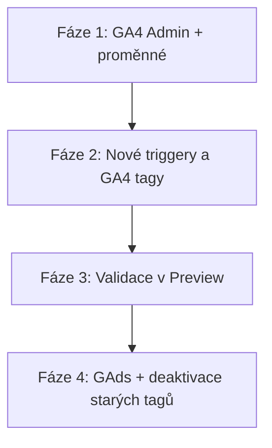

# GTM implementační plán — přechod na event-based tracking s A/B variantami

**Kontejner:** `GTM-58FFPMBH`  
**Aplikace:** Handy Hands kalkulátor (Next.js)  
**A/B test:** `pdf_funnel_v1` — varianta `a` (kontrola) vs. `b` (email gate)

Tento dokument popisuje, jak upravit **stávající tagy** v GTM tak, aby odpovídaly novému systému měření v aplikaci. Aplikace nyní posílá události do `dataLayer` přes `sendGTMEvent` — GTM je musí přeposlat do GA4 (a případně Google Ads) včetně parametru `ab_variant`.

> Technická reference k událostem z kódu: [`src/utils/ab-analytics.ts`](../src/utils/ab-analytics.ts)  
> Anglická verze základního setupu: [`GTM_GA4_SETUP.md`](GTM_GA4_SETUP.md)

---

## 1. Shrnutí změny

### Starý systém (aktuální tagy v GTM)

| Tag | Jak měří | Problém |
|-----|----------|---------|
| `GA4 - Vygenerovaná kalkulace` | Custom event `Vygenerována kalkulace` | Aplikace tento event **už neposílá**; chybí varianta A/B |
| `GA4 - Stáhnout kalkulaci v PDF` | Klik na tlačítko | Měří klik, ne úspěšné stažení; chybí varianta A/B |
| `GA4 - Odeslat návrh smlouvy` | Klik na tlačítko | Měří klik, ne úspěšné odeslání; chybí varianta A/B |
| `GAds - Vygenerovaná kalkulace` | Totéž jako GA4 | Totéž |
| `GAds - Stáhnout kalkulaci v PDF` | Klik | Totéž |
| `GAds - Odeslat návrh smlouvy` | Klik | Totéž |

### Nový systém (z kódu aplikace)

| dataLayer `event` | Kdy se odešle | GA4 událost | Parametry |
|-------------------|---------------|-------------|-----------|
| `ab_exposure` | První návštěva funnel stránky v relaci (`/vysledek` nebo `/poptavka`) | `ab_exposure` | `ab_variant`, `ab_test_name` |
| `view_item` | Úspěšné načtení výsledků na `/vysledek` (1× na hash/relaci) | `view_item` | `ab_variant`, `currency`, `value`, `items[]` |
| `generate_lead` | Úspěšné stažení PDF | `generate_lead` | `lead_type: pdf_download`, `ab_variant`, `value`, … |
| `generate_lead` | Úspěšné odeslání poptávky | `generate_lead` | `lead_type: poptavka`, `ab_variant`, `value`, … |

**Výhoda:** měříme skutečné konverze (po úspěšné API odpovědi), ne jen kliky. Každá událost nese `ab_variant` pro A/B reporting.

---

## 2. Mapování starých tagů → nový systém

| Stávající tag | Akce | Nový ekvivalent |
|---------------|------|-----------------|
| `GA4 - Config Tag - Calculator` | **Upravit** | Přidat user property `ab_variant`; ponechat trigger `Initialization - Kalkulator` |
| `GA4 - Config Tag - Main Web` | **Beze změny** | Netýká se kalkulátoru |
| `GA4 - Vygenerovaná kalkulace` | **Deaktivovat** (po validaci) | Nahrazeno tagem `GA4 - view_item` (trigger `CE - view_item`) |
| `GA4 - Stáhnout kalkulaci v PDF` | **Deaktivovat** (po validaci) | Nahrazeno `GA4 - generate_lead` s filtrem `lead_type = pdf_download` |
| `GA4 - Odeslat návrh smlouvy` | **Deaktivovat** (po validaci) | Nahrazeno `GA4 - generate_lead` s filtrem `lead_type = poptavka` |
| `GA4 - Form kontakt` | **Beze změny** | Kontaktní formuláře na hlavním webu, mimo kalkulátor |
| `GAds - Vygenerovaná kalkulace` | **Deaktivovat** (po validaci) | Volitelně nový GAds tag na `view_item` (mikro-konverze) |
| `GAds - Stáhnout kalkulaci v PDF` | **Upravit trigger** | Přepnout na `CE - generate_lead` + podmínka `lead_type = pdf_download` |
| `GAds - Odeslat návrh smlouvy` | **Upravit trigger** | Přepnout na `CE - generate_lead` + podmínka `lead_type = poptavka` |
| `GAds - Contact - Form - Grab - Enhance Conversion` | **Upravit** | Odebrat staré kalkulátorové triggery (klik/PDF), ponechat formulářové |
| `GAds - Conversion Linker` | **Beze změny** | |
| `GAds - Google Tag AW-17703368732` | **Beze změny** | |
| `GAds - Remarketing Google` | **Beze změny** | |
| `GAds - Form kontakt` | **Beze změny** | |
| `Cookie-Script` | **Beze změny** | Consent Mode — ověřit, že nové tagy respektují souhlas |
| `Complianz` / `Consent - Updated` | **Ponechat pozastavené** | Nepoužívat paralelně s Cookie-Script |
| `Event - Set-Cookie-Form-Email` | **Zkontrolovat** | Neposílat email do GA4; slouží jen pro interní cookie |

---

## 3. Fáze implementace

Doporučený postup ve **4 fázích**. Každou fázi nejdřív otestujte v GTM Preview, teprve pak publikujte.



---

## Fáze 1 — GA4 Admin a GTM proměnné

### 3.1 Vlastní definice v GA4 (Admin → Vlastní definice)

**Rozměry událostí (Event-scoped):**

| Název v GA4 | Parametr události | Popis |
|-------------|-------------------|-------|
| AB varianta | `ab_variant` | `a` nebo `b` |
| AB test | `ab_test_name` | `pdf_funnel_v1` |
| Typ leadu | `lead_type` | `pdf_download` / `poptavka` |
| Typ služby | `service_type` | ID služby z kalkulátoru |

**Vlastnost uživatele (User-scoped):**

| Název v GA4 | Vlastnost uživatele |
|-------------|---------------------|
| AB varianta | `ab_variant` |

### 3.2 Klíčové události (konverze) v GA4

| Událost | Podmínka | Priorita |
|---------|----------|----------|
| `generate_lead` | `lead_type` = `poptavka` | **Primární konverze** (závazná poptávka) |
| `generate_lead` | `lead_type` = `pdf_download` | Sekundární konverze (stažení PDF) |
| `view_item` | — | Mikro-konverze / horní část funnelu |

> **Poznámka k `value`:** hodnota v událostech je **měsíční cena v CZK**, ne jednorázový obrat.

### 3.3 Nové proměnné Data Layer v GTM

V GTM → **Proměnné** → **Nová** → **Proměnná datové vrstvy**:

| Název proměnné | Název proměnné datové vrstvy | Verze |
|----------------|------------------------------|-------|
| `DLV - ab_variant` | `ab_variant` | 2 |
| `DLV - ab_test_name` | `ab_test_name` | 2 |
| `DLV - lead_type` | `lead_type` | 2 |
| `DLV - service_type` | `service_type` | 2 |
| `DLV - value` | `value` | 2 |
| `DLV - currency` | `currency` | 2 |
| `DLV - items` | `items` | 2 |

### 3.4 Pomocná proměnná (volitelně)

**Regulární výraz** nebo **Proměnná vlastní události** pro filtrování GAds tagů:

| Název | Typ | Použití |
|-------|-----|---------|
| `CE - lead_type equals poptavka` | Podmínka v triggeru | `lead_type` rovná se `poptavka` |
| `CE - lead_type equals pdf_download` | Podmínka v triggeru | `lead_type` rovná se `pdf_download` |

---

## Fáze 2 — Nové triggery a GA4 tagy

### 4.1 Nové triggery (Spouštěcí pravidla)

| Název triggeru | Typ | Nastavení |
|----------------|-----|-----------|
| `CE - ab_exposure` | Vlastní událost | Název události: `ab_exposure` |
| `CE - view_item` | Vlastní událost | Název události: `view_item` |
| `CE - generate_lead` | Vlastní událost | Název události: `generate_lead` |
| `CE - generate_lead - poptavka` | Vlastní událost | Událost: `generate_lead` + podmínka: `lead_type` rovná se `poptavka` |
| `CE - generate_lead - pdf` | Vlastní událost | Událost: `generate_lead` + podmínka: `lead_type` rovná se `pdf_download` |

### 4.2 Úprava existujícího tagu `GA4 - Config Tag - Calculator`

**Neměňte Measurement ID ani trigger.** Pouze doplňte:

1. Otevřete tag → **Nastavení parametru konfigurace** (nebo Fields to Set)
2. Přidejte **Vlastnost uživatele:**
   - Název: `ab_variant`
   - Hodnota: `{{DLV - ab_variant}}`
3. Uložte

> Tím se varianta přiřadí uživateli, jakmile dorazí první událost s `ab_variant` (typicky `ab_exposure`).

### 4.3 Nový tag: `GA4 - ab_exposure`

| Pole | Hodnota |
|------|---------|
| Typ | Google Analytics: událost GA4 |
| Konfigurační tag | `GA4 - Config Tag - Calculator` |
| Název události | `ab_exposure` |
| Parametry události | `ab_variant` = `{{DLV - ab_variant}}`, `ab_test_name` = `{{DLV - ab_test_name}}` |
| Vlastnosti uživatele | `ab_variant` = `{{DLV - ab_variant}}` |
| Spouštěcí pravidlo | `CE - ab_exposure` |
| Složka | GA4 |
| Souhlas | Stejné jako ostatní analytické tagy (analytics_storage) |

### 4.4 Nový tag: `GA4 - view_item` (nahrazuje Vygenerovaná kalkulace)

| Pole | Hodnota |
|------|---------|
| Typ | Google Analytics: událost GA4 |
| Konfigurační tag | `GA4 - Config Tag - Calculator` |
| Název události | `view_item` |
| Parametry | `ab_variant`, `ab_test_name`, `currency`, `value`, `items` (vše z DLV) |
| Spouštěcí pravidlo | `CE - view_item` |
| Složka | GA4 |

### 4.5 Nový tag: `GA4 - generate_lead` (nahrazuje PDF + poptávka)

Jeden tag pro oba typy leadů (GA4 rozliší podle `lead_type`):

| Pole | Hodnota |
|------|---------|
| Typ | Google Analytics: událost GA4 |
| Konfigurační tag | `GA4 - Config Tag - Calculator` |
| Název události | `generate_lead` |
| Parametry | `ab_variant`, `ab_test_name`, `lead_type`, `service_type`, `currency`, `value` |
| Spouštěcí pravidlo | `CE - generate_lead` |
| Složka | GA4 |

---

## Fáze 3 — Validace před vypnutím starých tagů

### 5.1 Lokální test (pouze `npm run dev`)

Parametry `?ab=a` / `?ab=b` **fungují jen lokálně**, ne na Vercel preview/produkci.

1. Spusťte `npm run dev`
2. GTM → **Náhled** → připojte `localhost:3000`
3. Dokončete kalkulaci → `/vysledek?hash=…&ab=a`
4. V konzoli GTM Preview ověřte posloupnost:

```
ab_exposure  →  view_item  →  generate_lead (pdf_download)  →  generate_lead (poptavka)
```

5. Zkontrolujte parametry každé události:

| Událost | Musí obsahovat |
|---------|----------------|
| `ab_exposure` | `ab_variant: a`, `ab_test_name: pdf_funnel_v1` |
| `view_item` | `ab_variant`, `currency: CZK`, `value`, `items[0].item_id` |
| `generate_lead` (PDF) | `lead_type: pdf_download`, `ab_variant`, `service_type` |
| `generate_lead` (poptávka) | `lead_type: poptavka`, `ab_variant`, `service_type` |

6. Opakujte s `&ab=b`
7. **GA4 DebugView:** Admin → DebugView — ověřte doručení a vlastnost uživatele `ab_variant`
8. **Bez PII:** v payloadu nesmí být email ani jméno
9. **Dedup:** reload `/vysledek` — `view_item` se **nesmí** odeslat znovu pro stejný hash v téže relaci
10. Vymažte `sessionStorage` klíče `ab_exposure_sent` a `view_item_sent:*` mezi testy

### 5.2 Paralelní běh (doporučeno 1–2 týdny)

| Staré tagy | Nové tagy |
|------------|-----------|
| Nechte **aktivní** | **Aktivní** současně |
| Sledujte počty v GA4 | Porovnejte — nové by měly být ≤ starých (klik vs. úspěch) |

Po potvrzení správnosti přejděte na Fázi 4.

---

## Fáze 4 — Google Ads a deaktivace starých tagů

### 6.1 Úprava `GAds - Stáhnout kalkulaci v PDF`

| Pole | Stará hodnota | Nová hodnota |
|------|---------------|--------------|
| Spouštěcí pravidlo | `Click - Stáhnout kalkulaci v PDF` | `CE - generate_lead - pdf` |
| Konverzní hodnota | (dle nastavení) | `{{DLV - value}}` (měsíční CZK) |

### 6.2 Úprava `GAds - Odeslat návrh smlouvy`

| Pole | Stará hodnota | Nová hodnota |
|------|---------------|--------------|
| Spouštěcí pravidlo | `Click - Odeslat návrh smlouvy` | `CE - generate_lead - poptavka` |
| Konverzní hodnota | (dle nastavení) | `{{DLV - value}}` |

### 6.3 Úprava `GAds - Contact - Form - Grab - Enhance Conversion`

Z triggerů **odeberte** (pokud tam jsou):

- `Click - Odeslat návrh smlouvy`
- `Click - Stáhnout kalkulaci v PDF`
- `Event - Vygenerována kalkulace`

**Ponechte** pouze triggery kontaktních formulářů.

> Enhanced Conversions stále nesmí posílat email do GA4 událostí z kalkulátoru — ověřte, že tag čte email jen z povolených zdrojů (formuláře na webu).

### 6.4 `GAds - Vygenerovaná kalkulace`

**Varianta A (doporučeno):** Deaktivovat — `view_item` není přímá konverze v Ads.

**Varianta B:** Přepnout trigger na `CE - view_item` jako mikro-konverzi pro remarketing (nižší hodnota).

### 6.5 Deaktivace starých GA4 tagů (po validaci)

Postupně **pozastavte** (ne smažte hned):

1. `GA4 - Vygenerovaná kalkulace`
2. `GA4 - Stáhnout kalkulaci v PDF`
3. `GA4 - Odeslat návrh smlouvy`

Po 7 dnech bez anomálií tagy trvale odstraňte nebo přesuňte do složky „Archiv“.

### 6.6 Úklid složek (volitelně)

Některé GAds tagy jsou ve složce **GA4** — přesuňte do **GAds** pro přehlednost:

- `GAds - Form kontakt`
- `GAds - Odeslat návrh smlouvy`
- `GAds - Stáhnout kalkulaci v PDF`

---

## 7. Consent Mode (Cookie-Script)

Aplikace načítá GTM **bez podmínky** — stejně jako dříve. Cookie-Script CMP musí řídit:

| Typ souhlasu | Tagy ovlivněné |
|--------------|----------------|
| `analytics_storage` | Všechny nové GA4 tagy (`ab_exposure`, `view_item`, `generate_lead`) |
| `ad_storage` | GAds konverzní tagy |

**Kontrola:** V GTM Preview s odmítnutým souhlasem se nové tagy **nesmí** spustit. Po udělení souhlasu ano.

---

## 8. A/B reporting v GA4

### Explorace — srovnání variant

1. **Průzkum** → Prázdná → Volné formy
2. Segmenty: `ab_variant` = `a` vs. `b`
3. Metriky:
   - Počet `view_item` (exponovaní uživatelé s výsledkem)
   - Počet `generate_lead` kde `lead_type = pdf_download`
   - Počet `generate_lead` kde `lead_type = poptavka`
4. Vypočítejte:
   - **PDF rate** = `generate_lead (pdf)` / `view_item`
   - **Poptávka rate** = `generate_lead (poptavka)` / `view_item`

### Vysvětlení variant

| `ab_variant` | UX |
|--------------|-----|
| `a` | Cena viditelná hned — kontrolní skupina |
| `b` | Email gate — cena až po stažení PDF |

---

## 9. Kontrolní seznam před publikací

- [ ] V GA4 zaregistrovány vlastní definice (`ab_variant`, `lead_type`, …)
- [ ] Klíčová událost `generate_lead` + filtr `poptavka` nastavena
- [ ] Vytvořeno 7 DLV proměnných
- [ ] Vytvořeno 5 triggerů (`CE - ab_exposure`, `view_item`, `generate_lead`, 2× s filtrem lead_type)
- [ ] Vytvořeny 3 nové GA4 tagy
- [ ] Upraven `GA4 - Config Tag - Calculator` (user property)
- [ ] Otestováno v GTM Preview — varianta `a` i `b`
- [ ] Ověřeno v GA4 DebugView
- [ ] Žádné PII v událostech
- [ ] Upraveny GAds triggery (PDF, poptávka)
- [ ] Upraven `GAds - Contact - Form - Grab - Enhance Conversion`
- [ ] Staré GA4 tagy pozastaveny po validaci
- [ ] Kontejner publikován s popisem verze

**Doporučený popis verze při publikaci:**
```
Kalkulátor: event-based tracking s A/B variantami (ab_exposure, view_item, generate_lead). Nahrazení click-based tagů.
```

---

## 10. Časté problémy

| Problém | Příčina | Řešení |
|---------|---------|--------|
| Události v `dataLayer`, ale GA4 nic neukazuje | Chybí GA4 event tagy nebo špatný config tag | Zkontrolujte, že event tagy používají `GA4 - Config Tag - Calculator` |
| Dvojité konverze | Staré i nové tagy aktivní současně | Pozastavte staré click tagy |
| `ab_variant` chybí v reportech | Custom dimension neregistrována v GA4 Admin | Zaregistrujte a počkejte 24–48 h |
| `?ab=b` nefunguje na preview | Override jen v dev módu | Testujte lokálně (`npm run dev`) |
| GAds konverze klesly | Event-based měří méně než kliky | Očekávané — přesnější data |
| `view_item` se neodešle podruhé | Dedup v aplikaci (sessionStorage) | Správné chování |

---

## 11. Reference — payload z aplikace

Příklad `dataLayer.push` po načtení výsledků:

```json
{
  "event": "view_item",
  "ab_variant": "b",
  "ab_test_name": "pdf_funnel_v1",
  "currency": "CZK",
  "value": 4500,
  "items": [{ "item_id": "panel-building", "item_name": "Úklid panelových domů", "price": 4500 }]
}
```

Příklad po stažení PDF:

```json
{
  "event": "generate_lead",
  "ab_variant": "b",
  "ab_test_name": "pdf_funnel_v1",
  "lead_type": "pdf_download",
  "service_type": "panel-building",
  "currency": "CZK",
  "value": 4500
}
```

Příklad po odeslání poptávky:

```json
{
  "event": "generate_lead",
  "ab_variant": "b",
  "ab_test_name": "pdf_funnel_v1",
  "lead_type": "poptavka",
  "service_type": "panel-building",
  "currency": "CZK",
  "value": 4500
}
```

---

## 12. Co neměnit

| Tag / oblast | Důvod |
|--------------|-------|
| `GA4 - Config Tag - Main Web` | Hlavní web, jiná doména/kontext |
| `GA4 - Form kontakt` | Kontaktní formuláře mimo kalkulátor |
| `GAds - Form kontakt` | Totéž |
| `GAds - Conversion Linker` | Nutné pro atribuci |
| `GAds - Remarketing Google` | Remarketing |
| `Cookie-Script` | Aktivní CMP |
